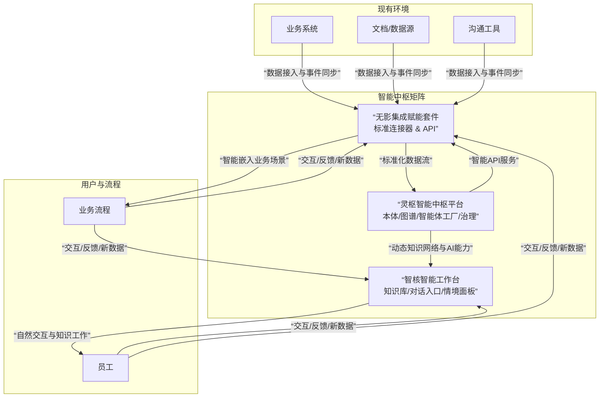

# **「企业智能中枢」产品矩阵立项报告**

## **摘要**
在AI从“感知”走向“认知”的关键转折点，企业面临知识资产碎片化、决策缺乏数据连续性、智能化工具与业务流脱节的核心痛点。我们提出「灵枢-智核-无影」产品矩阵，旨在构建一个**统一认知、主动赋能、持续进化**的企业智能生命体。本方案通过“基座+应用+生态”三层架构，系统性解决从数据孤岛到组织智能的升维挑战，致力于在未来三年内，成为企业级认知智能基础设施的定义者。

---

## **一、战略背景与机遇**

### **1.1 组织核心痛点**
*   **信息与知识孤岛**：企业知识散落在数百个系统与个人脑中，搜索耗时占知识工作者时间的30%以上，且无法形成连贯洞察。
*   **知识资产流失与贬值**：员工离职导致经验流失，文档随业务变化快速过时，企业无法有效沉淀和复用“活”的知识。
*   **决策缺乏数据连续性**：决策依赖片面报告与个人经验，缺乏一个基于全局、实时关联事实的“认知仪表盘”。
*   **智能化与业务“两张皮”**：现有的AI工具多为通用型聊天机器人，无法深度理解企业专属的业务逻辑和语境，难以嵌入关键业务流程形成闭环。

### **1.2 市场趋势与拐点**
*   **技术拐点**：大模型技术使机器理解自然语言成为可能，但企业级应用需要**专有知识增强**与**业务流程闭环**。知识图谱与Agent技术正从实验室走向工程化落地。
*   **需求升级**：企业数字化重点正从“流程线上化”（ERP/CRM）转向“运营智能化”。预算决策权从IT部门上移至业务负责人与战略层，为能带来直接业务价值的智能解决方案打开了预算空间。
*   **信创与自主可控**：对数据主权、模型安全与业务连续性的要求，使得具备私有化部署和自主演进能力的智能基座成为央国企、大型民企的刚性需求。

### **1.3 我们的独特机遇**
在通用大模型（提供基础语言理解）与垂直业务应用（解决具体场景问题）之间，存在一个巨大的**战略断层**：**企业级统一认知层**。
我们的机遇在于：提供一个**可私有化部署、基于本体统一语义、并能通过Agent将智能注入全业务流程的“企业数字大脑”及配套应用**。这并非替代现有系统，而是成为连接并赋能一切系统的“智能中枢”。

---

## **二、产品愿景与定位**

### **2.1 顶层愿景**
**成为企业构建可持续竞争壁垒的下一代智能基础设施，定义“组织智能”新范式。**

### **2.2 产品愿景**
**打造一个能与企业共同学习、进化，将集体智慧实时转化为生产力的“智能生命体”。**

### **2.3 产品定位**
*   **「灵枢」**：企业级**智能中枢平台**（数字大脑）。提供统一认知的基座能力，私有化部署。
*   **「智核」**：面向全员的**智能工作台**（核心界面）。提供沉浸式的智能工作体验，支持SaaS与一体机形态。
*   **「无影」**：智能**集成赋能套件**（连接血管）。以PaaS化工具实现智能能力与现有生态的无缝融合。

### **2.4 核心理念**
1.  **统一认知**：通过“本体论”建立企业唯一的事实与语义标准，打破孤岛。
2.  **主动赋能**：智能体（Agent）从被动响应走向主动预见与闭环执行。
3.  **生态融合**：智能如水电般融入现有业务流程，而非制造新的应用孤岛。
4.  **持续进化**：系统在使用中持续学习，形成“数据-知识-智能-新数据”的增强回路。

### **2.5 价值主张**
*   **对CEO/战略层**：构建难以复制的“组织认知”优势，实现数据驱动的精准决策与战略敏捷性。
*   **对业务部门**：获得一个深度理解业务、永不疲倦的“数字团队”，极大提升创新与执行效率。
*   **对IT/数据部门**：获得一个统一、合规、可控的智能能力底座，终结烟囱式AI项目困局。

---

## **三、五看三定：系统洞察与关键决策**

### **3.1 五看系统洞察：穿透表象，洞察本质矛盾与结构性机会**

**一看行业/趋势：从“技术可用性”走向“价值工程化”，核心矛盾是“生产力与生产关系的错配”**
*   **底层驱动力**：AI技术栈（大模型、Agent框架、图计算）正迅速工业化，降低了“做出一个智能功能”的门槛。但企业真正的瓶颈从“技术有无”转向 **“价值如何被安全、稳定、规模化地生产出来”**。
*   **核心矛盾**：指数级增长的技术生产力（Agent可自动处理任务），与线性演进甚至僵化的企业组织生产关系（权责、流程、考核、合规）之间，存在巨大摩擦。行业最大陷阱是“技术炫技但无法融入业务流程”。
*   **我们的洞见**：未来的赢家不是拥有最先进模型的技术公司，而是能**最佳地设计“人机协同新生产关系”** 的产品与服务体系。这意味着产品必须内置治理、审计、权责分配机制，成为组织变革的“催化剂”而非“颠覆者”。

**二看市场/客户：需求分层与“买单人演化”，预算从IT成本中心向业务价值中心转移**
*   **需求金字塔**：
    *   **基层（工具层）**：员工需要“立刻解决问题”的魔法（如一键生成周报）。需求广泛但付费浅、粘性低。
    *   **中层（流程层）**：部门负责人需要“提升团队效率与质量”（如确保所有方案符合最新标准）。需求聚焦，愿意为可量化的ROI付费。
    *   **高层（战略层）**：决策者需要“增强组织认知与抗风险能力”（如洞察跨部门风险、加速创新循环）。需求抽象，预算巨大，但决策周期长，关乎信任。
*   **买单人演化**：早期由IT/数字化部门采购（技术驱动），中期由核心业务部门采购（价值驱动），远期将由战略部、总办直接驱动（战略驱动）。我们的产品路线必须平行满足这三层需求的演进，并设计清晰的升级路径。

**三看竞争：在“平台霸权”与“垂直应用”的夹缝中，定义“企业认知中间件”新生态位**
*   **竞争格局三维分析**：
    1.  **维度一：控制力 vs 深度**
        *   **巨头平台（高控制力，浅深度）**：控制入口与通用能力，但做不了、也不愿做深度的企业专属业务定制。这是我们的“掩护者”而非直接对手。
        *   **垂直应用（低控制力，高深度）**：在单一场景极深，但数据与能力被封存在竖井中。这是我们的“未来整合对象”。
    2.  **维度二：通用性 vs 专有性**
        *   绝大多数竞品在争夺“通用能力增强”市场（写邮件、做摘要）。我们主动选择“专有知识赋能”的艰难道路，构建更高壁垒。
    3.  **维度三：产品 vs 服务**
        *   传统KM厂商卖的是“产品+定制开发服务”。我们卖的是“产品化平台+知识工程方法论”，旨在通过“灵枢”将定制服务产品化、自动化。
*   **我们的生态位**：**企业级认知中间件**。我们不做所有应用，但所有智能应用都需要我们的“认知基座”（灵枢）来理解企业；我们不取代所有入口，但通过“无影”将智能注入所有入口。我们本质上是 **“智能时代的SAP NetWeaver（应用平台） + Informatica（数据集成） + ServiceNow（自动化）”** 的结合体，但以AI原生方式重构。

**四看自己：最大的风险是“能力的诅咒”与“路径的迷失”**
*   **优势中的陷阱**：
    *   **架构优势可能沦为“过度工程”**：对“完美本体”和“统一图谱”的追求，可能导致产品过于笨重，无法响应早期客户的即时需求。
    *   **技术理想可能脱离商业现实**：团队容易被Agent的长期愿景吸引，而忽视第一阶段必须解决的、琐碎但关键的“脏活”（如非结构化文档的稳定解析、与老旧系统的奇葩接口对接）。
*   **核心能力缺位**：我们可能擅长构建系统，但极度缺乏 **“企业知识工程”的咨询服务能力**。帮助客户定义首个本体、设计知识运营流程，这与销售产品同等重要。必须将这部分能力产品化、模板化，或建立强大的伙伴生态。
*   **资源分配悖论**：三款产品并行开发，极易导致资源分散。“灵枢”是壁垒但难变现，“智核”是现金牛但易被模仿，“无影”是生态关键但初期无收入。必须设计精确的资源投放节奏和协同机制。

**五看机会：非对称机会在于“关键业务流的智能增强”与“数据资产的价值重估”**
*   **机会一：从“辅助岗”切入“核心岗”**。避开泛泛的办公自动化，选择直接影响企业收入、成本、风险的“核心业务流”（如**大客户销售支持、研发缺陷分析、供应链风险预警**）。在这些场景下，对知识深度、准确性和实时性的要求极高，通用工具无效，这正是“灵枢”专有知识的用武之地，能建立极高门槛。
*   **机会二：激活“沉睡的数据资产”**。企业多年积累的合同、项目文档、客服记录是一座未被计算的金矿。我们可以提供“数据资产价值评估与激活”服务，通过“灵枢”将其转化为可查询、可关联、可推理的战略资产，这能从CIO乃至CFO处获得预算。
*   **机会三：成为“国产化替代”中的智能升级选项**。在信创替换过程中，企业不仅要“替换”，更想“升级”。我们可以与国内基础软件厂商（数据库、OA、ERP）合作，成为其“智能增强套件”，搭乘国产化快车。

### **3.2 三定关键战略决策：基于深度洞察的聚焦与取舍**

**一定战略控制点：构建三层环环相扣的“价值壁垒”**
1.  **第一层（产品层）：可计算、可进化的“企业本体”**。这不是一个静态的数据库，而是一个随着使用不断被验证、修正和丰富的“企业语义共识引擎”。它封装了企业最独特的业务逻辑和知识，是**所有智能的“源代码”**，迁移成本极高。
2.  **第二层（生态层）：基于“无影”的深度业务集成网络**。不仅连接系统，更**理解并能在关键业务流程中发起行动**。集成的深度（从数据读取到双向操作）和广度（覆盖核心业务系统数量）构成强大的网络效应。使用我们集成的业务场景越多，我们的系统就越不可或缺。
3.  **第三层（范式层）：定义“人机协同”的卓越实践与方法论**。我们将通过灯塔客户，沉淀出一套关于如何用“智核”重构知识工作流程、如何用“灵枢”治理企业知识、如何设立“人机责任边界”的最佳实践。这将成为行业标准，我们则是标准的布道者与主要工具提供者。

**二定目标：以“非线性的里程碑”驱动跨越式发展**
*   **里程碑一（18个月）：完成“从零到一”的范式验证**
    *   **目标**：在1-2个严格选定的行业（如**高端制造研发**或**金融投研**），实现“**灵枢**”驱动的“**智核**”在单个核心业务流程中，将关键知识获取时间**降低70%**，并实现至少一个由“**无影**”触发的**自动化决策建议被业务系统采纳**。
    *   **意义**：证明“统一认知-主动赋能”模式在最具挑战性的场景下可行，并产生可货币化的价值。
*   **里程碑二（36个月）：实现“从一到多”的规模化复制**
    *   **目标**：形成3个以上行业的标准化“本体模板”和“场景套餐”。70%的新增客户采用“标准产品+轻度配置”模式上线。“无影”连接器被至少2家主流ISV（独立软件开发商）原生集成。
    *   **意义**：商业模式从“高度定制项目制”转向“高毛利的标准化产品+订阅服务”，实现规模化增长。
*   **里程碑三（60个月）：构建“从多到平台”的生态统治力**
    *   **目标**：“灵枢”成为所在领域企业智能项目的**默认选型基座**。围绕“无影”的开发者生态成熟，应用市场出现大量由伙伴开发的垂直智能应用。公司收入中，平台生态收入占比超过30%。
    *   **意义**：完成从产品公司向平台公司的跃迁，建立最稳固的竞争壁垒。

**三定策略：一组精密的、动态调整的“组合行动”**
1.  **产品策略：以“智核”为矛，“灵枢”为盾，“无影”为网**
    *   **早期**：以“**智核（SaaS版）**”作为快速获客和收集场景数据的“探针”。功能上聚焦**1-2个杀手级效率场景**（如智能会议纪要生成与行动项分发），追求极致用户体验。
    *   **中期**：当客户产生对“更准、更深”知识的需求时，顺势推出基于“**灵枢**”的私有化方案。此时，“智核”成为“灵枢”能力的**最佳展示界面和孵化器**。
    *   **长期**：通过“**无影**”将能力开放，鼓励生态创新。我们的核心产品逐渐“后台化”，成为智能生态的“水和电”。
2.  **市场进入策略：“自上而下”与“自下而上”的钳形攻势**
    *   **自上而下（战略销售）**：面向CEO/战略层，讲述“组织智能”的故事，获取战略合作和试点许可。
    *   **自下而上（产品驱动增长）**：在试点部门内，让“智核”凭借出色的单点体验在员工中自然传播，形成基层拥护。
    *   **关键**：必须建立机制，让“自上而下的指令”与“自下而上的需求”在“灵枢”的部署和优化上汇合，避免脱节。
3.  **竞争与生态策略：明确的“合作、整合、竞争”三分法**
    *   **合作**：与云厂商、咨询公司、系统集成商合作。我们提供“智能内核”，他们提供客户关系、基础设施和落地服务。
    *   **整合**：对垂直领域优秀但狭窄的SaaS应用，通过“无影”实现深度集成，甚至将其作为“智核”内的一个特色功能模块，丰富我们的场景。
    *   **竞争**：清晰界定，我们只与那些同样想构建“企业通用认知层”的玩家正面竞争。对于在应用层创新的玩家，我们更愿成为其赋能者。

---

## **四、产品架构与解决方案**

### **4.1 整体架构**

### **4.2 产品演进路线图**
| 阶段 | 时间 | 灵枢（基座） | 智核（应用） | 无影（生态） | 核心目标 |
| :--- | :--- | :--- | :--- | :--- | :--- |
| **奠基** | 0-12个月 | 1.0：核心本体与图谱引擎上线，基础智能体工厂 | 1.0：智能知识库与对话式问答MVP | 1.0：主流IM与办公套件连接器 | 完成产品闭环，验证核心场景 |
| **扩张** | 13-30个月 | 2.0：强化进化引擎，支持多模态知识 | 2.0：上线策展空间与复杂任务Agent | 2.0：开放平台与主流业务系统连接器 | 打造行业标杆，建立生态基础 |
| **引领** | 31-48个月 | 3.0：跨组织知识联邦与高级认知模拟 | 3.0：多智能体协作与组织认知界面 | 3.0：繁荣的ISV生态与应用市场 | 确立市场领导地位，构建平台生态 |

### **4.3 核心能力演进路线：以Agent为例**
*   **阶段一（响应命令）**：基于文档检索的问答、简单信息提取与填写。
*   **阶段二（主动赋能）**：掌握业务流程API，能串联多系统完成复杂任务（如“筹备一次产品发布”），具备初步的个性化记忆。
*   **阶段三（自主协同）**：多领域Agent自主协作解决跨部门问题（如“分析季度业绩波动原因并制定行动方案”），具备战略级模式识别与预见能力。

---

## **五、商业模式设想**

1.  **组合定价模式**：
    *   **「灵枢」**：按**内核资源（图谱实体数、计算量）** 和**功能模块**的年度许可费。
    *   **「智核」**：按**活跃用户数**的年度订阅费（SaaS），或与灵枢绑定的一体机许可。
    *   **「无影」**：按**连接器数量**或**API调用量**计费，对独立软件开发商（ISV）提供分润模式。
2.  **销售路径**：
    *   **路径A（整体方案）**：面向大型企业，销售“灵枢+智核+无影”整体许可及专业服务。
    *   **路径B（能力先行）**：面向中小客户，销售“智核（SaaS版）+ 托管式灵枢能力”订阅。
    *   **路径C（生态赋能）**：向合作伙伴销售无影开发许可证及技术支持。

---

## **六、实施路线图（第一阶段：0-12个月）**

| 季度 | 核心目标 | 关键行动 | 成功标志 |
| :--- | :--- | :--- | :--- |
| **Q1-Q2** | 完成MVP开发与POC验证 | 1. 组建核心跨职能团队。 2. 开发灵枢核心图谱引擎与智核基础界面。 3. 与1-2家种子客户共研，定义首发场景（如“智能技术问答”）。 | 1. 内部Demo可用。 2. 种子客户签订POC协议。 |
| **Q3** | 启动灯塔客户项目 | 1. 交付首个私有化部署版本。 2. 启动首个灯塔客户实施，聚焦单一高价值部门。 3. 发布无影基础连接器。 | 1. 灯塔客户项目上线，核心场景跑通。 2. 获得首批用户活跃度数据。 |
| **Q4** | 实现产品市场化闭环 | 1. 根据反馈迭代产品至1.0正式版。 2. 签约第2-3家灯塔客户，验证可复制性。 3. 建立初步的产品营销与销售材料。 | 1. 完成首个客户成功案例复盘。 2. 建立销售线索管道。 |

---

## **七、成功度量体系**

### **7.1 产品健康度度量**
*   **采用度**：智核的周活跃用户（WAU）占比、核心Agent功能的周使用频率。
*   **知识生态活跃度**：每周新增/更新的知识图谱实体数、用户贡献内容占比。
*   **系统性能**：知识检索平均响应时间、任务闭环成功率。

### **7.2 客户价值度量**
*   **效率提升**：目标场景下（如方案撰写、信息查找）的任务完成时间降低百分比。
*   **质量提升**：知识复用率、决策支持建议的采纳率。
*   **业务影响**：（与客户共同定义）如新产品上市周期缩短、客户满意度提升相关指标。

### **7.3 商业成果度量**
*   **市场验证**：灯塔客户数量、合同金额、净推荐值（NPS）。
*   **增长**：销售 pipeline 金额、新客户获取成本（CAC）、收入增长率。
*   **生态**：无影套件合作伙伴数量、基于平台开发的第三方应用数。

---
**结论**：本方案锚定企业智能化浪潮中的战略制高点，以系统性的产品矩阵应对复杂的市场挑战。我们清醒地认识到在技术、组织与市场层面的风险，并已将其融入实施路径与度量体系。建议批准立项，并授权组建精锐团队，以敏捷且坚定的姿态，开启此次定义未来的征程。