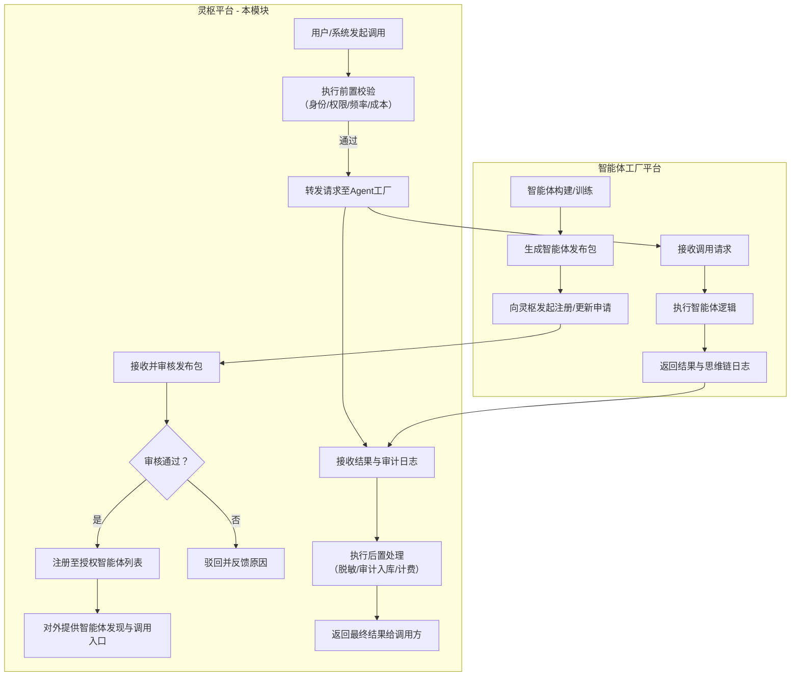

# **「灵枢」企业智能中枢平台 - 授权智能体接入与治理接口产品需求文档**

**文档版本：** V1.0 (FR4专项调整版)
**所属模块：** FR4: 授权智能体接入与治理接口
**产品定位：** 作为「灵枢」平台与独立统建的「智能体工厂平台」的标准化集成枢纽，负责在「灵枢」侧实现授权智能体的接入、治理、监控与调用，为最终用户提供统一、安全的智能体服务体验。

---

## **一、 模块概述**

### **1.1 核心目标**
鉴于「智能体工厂」将作为独立平台统一建设，本模块不再负责智能体的构建与编排，而是聚焦于：
1.  **统一接入**：为独立的Agent工厂平台提供标准化的接入接口，使其生成的智能体能够在「灵枢」的知识网络和权限体系下运行。
2.  **统一治理**：在「灵枢」侧对授权智能体进行统一的生命周期管理、安全策略应用、性能监控与成本核算。
3.  **统一消费**：为「灵枢」的各类用户提供统一、安全、便捷的智能体发现、授权与调用入口。

### **1.2 核心用户**
*   **「灵枢」平台用户（业务专家/管理者）**：作为智能体的最终消费者，在此发现、调用和管理其有权使用的智能体。
*   **「智能体工厂平台」开发者/业务人员**：作为智能体的生产者，通过「灵枢」提供的接口发布、更新其智能体，并查看在「灵枢」环境下的运行情况。
*   **「灵枢」平台管理员/治理官**：负责审核、授权、监控和管理接入「灵枢」的所有第三方智能体，确保其安全、合规、可控。

### **1.3 核心价值**
1.  **生态开放性**：支持接入符合规范的第三方智能体，丰富平台能力，避免重复建设。
2.  **治理一致性**：确保所有在「灵枢」环境下运行的智能体，均遵循统一的安全、权限、审计与成本管控策略。
3.  **用户体验统一性**：用户无需切换平台，即可在一个地方使用所有授权的高价值智能体服务。

---

## **二、 核心概念与协作模式**

### **2.1 核心概念**
*   **授权智能体**：指由独立「智能体工厂平台」创建，并通过「灵枢」平台审核、授权，可在「灵枢」知识网络与权限体系内被调用和运行的智能体服务。
*   **智能体发布包**：由「智能体工厂平台」生成的标准化描述文件，包含智能体的元信息、接口定义、权限需求、资源配置要求等。
*   **「灵枢」-「Agent工厂」接口规范**：两平台间用于智能体注册、注销、心跳、调用、审计数据传输的标准API协议。

### **2.2 跨平台协作流程**

---

## **三、 详细功能需求**

### **FR4.1 授权智能体接入与管理中心**

#### **FR4.1.1 智能体注册与审核流程**
**目标**：为第三方智能体提供标准化的接入申请与审批通道。
**功能描述：**
1.  **标准化发布包接口**：
    *   定义并对外提供《智能体发布包标准规范》，包含必需字段：
        *   **基础元数据**：智能体唯一ID、名称、版本、提供方、描述、图标、分类标签。
        *   **接口定义**：调用端点URL、协议（HTTP/gRPC）、输入/输出Schema、超时设置。
        *   **权限需求声明**：智能体运行所需访问的「灵枢」本体类型、知识范围、操作权限（读/写/关联）。
        *   **资源需求声明**：预估的算力、内存、并发限制。
        *   **合规与安全声明**：数据脱敏要求、是否生成内容、模型来源合规证明（可选）。
2.  **审核工作台**：
    *   **申请列表**：管理员可查看所有待审核、已通过、已驳回的智能体接入申请。
    *   **申请详情与沙盒测试**：点击任一申请，可查看完整的发布包内容，并可在**隔离的沙盒环境**中，使用测试数据对智能体进行试运行，验证其功能与安全性。
    *   **审批操作**：管理员可执行“通过”、“驳回”（需填写原因）、“要求补充材料”等操作。审批通过后，智能体自动注册至授权列表，并分配唯一的调用密钥。

#### **FR4.1.2 授权智能体生命周期管理**
**目标**：对已接入的智能体进行统一的上架、下架、版本更新管理。
**功能描述：**
1.  **授权列表与门户**：
    *   以应用商店的形式，向「灵枢」用户展示所有已授权的智能体。
    *   支持按分类、评分、使用热度排序和搜索。
    *   每个智能体有详情页，展示其功能、使用说明、权限需求、服务等级协议（SLA）。
2.  **订阅与授权管理**：
    *   用户/用户组可申请对智能体的使用权限，管理员进行审批。
    *   支持按时间、按调用次数、按部门预算等多种订阅模式。
3.  **版本控制与更新**：
    *   当「Agent工厂平台」发布智能体新版本时，需重新发起更新申请，流程同初次注册。
    *   「灵枢」平台支持灰度发布策略，可先将新版本推送给部分用户测试。
    *   提供版本回滚能力。

### **FR4.2 智能体统一调用网关与策略执行中心**

**目标**：作为所有智能体调用请求的统一入口，执行安全、合规、成本控制等策略。
**功能描述：**
1.  **统一API网关**：
    *   提供统一的API端点（如 `/api/v1/agent/invoke/{agent_id}`），接收所有调用请求。
    *   负责请求路由、协议转换、负载均衡。
2.  **调用前策略链**：
    在转发请求至实际智能体前，按顺序执行：
    *   **身份认证与鉴权**：验证调用者身份，并检查其是否具有调用该智能体的权限。
    *   **权限上下文注入**：根据调用者权限，动态修改请求参数，限制其对「灵枢」知识图谱的访问范围（如自动附加部门过滤条件）。
    *   **敏感信息预脱敏**：若请求参数中包含来自「灵枢」的敏感数据，按策略进行脱敏后再转发。
    *   **频率与配额限制**：检查个人/部门/企业的调用频率和配额是否超限。
    *   **成本预算检查**：根据智能体调用成本单价，检查当前预算是否充足。
3.  **调用后处理链**：
    在收到智能体返回结果后，执行：
    *   **结果合规扫描**：对智能体生成的文本内容进行合规性检查。
    *   **审计日志记录**：将本次调用的完整上下文（请求、响应、思维链日志）记录到「灵枢」的审计中心（FR5.3）。
    *   **成本结算**：根据调用消耗进行计费。
    *   **结果后脱敏**：根据调用者权限，对结果中的敏感信息进行最终脱敏。

### **FR4.3 智能体运行监控与审计集成**

#### **FR4.3.1 运行状态监控面板**
**目标**：在「灵枢」平台内集中监控所有授权智能体的运行健康状况。
**功能描述：**
1.  **健康检查与心跳**：要求智能体提供方实现健康检查端点，网关定期探测。
2.  **核心监控仪表盘**：
    *   **可用性状态**：实时显示各智能体服务是否在线。
    *   **性能指标**：展示调用量、平均响应时间、错误率（4xx/5xx）的趋势图。
    *   **配额与成本消耗**：展示各用户/部门对智能体的调用量及费用消耗情况。
    *   **告警配置**：支持对错误率飙升、响应时间过长、配额即将耗尽等场景设置告警。

#### **FR4.3.2 审计日志集成**
**目标**：确保所有智能体调用行为均被记录，满足可追溯、可审计要求。
**功能描述：**
1.  **标准化审计日志接口**：定义《智能体审计日志规范》，要求「Agent工厂平台」在每次调用后，必须返回结构化的**思维链执行日志**。
2.  **日志汇聚与存储**：「灵枢」统一调用网关负责收集并存储所有调用请求、响应及附带的思维链日志。
3.  **统一审计查询**：用户可以在「灵枢」的审计中心（FR5.3），通过统一的界面，查询任何智能体的历史调用记录，并查看其思维链详情。这实现了跨平台行为的统一审计。

### **FR4.4 智能体技能市场的对接与管理**

**目标**：作为「灵枢」技能市场与「Agent工厂平台」技能生态的桥梁。
**功能描述：**
1.  **技能注册接口**：允许「Agent工厂平台」将其开发的、符合规范的**技能模块**（如“合同条款抽取”、“供应链风险预测模型”）注册到「灵枢」的技能市场（原FR4.3）。
2.  **技能目录同步**：在「灵枢」的技能市场内，清晰标识出哪些是平台原生技能，哪些是来自第三方「Agent工厂」的技能。
3.  **技能使用计量**：第三方技能的使用同样纳入统一的计量、计费和权限管理体系。

---

## **四、 非功能性需求（接口与集成专项）**

1.  **性能**：
    *   统一调用网关增加的延迟P99 < 200毫秒。
    *   支持每秒万级的智能体并发调用请求。
2.  **可靠性**：
    *   网关需具备熔断、降级、重试机制。当后端智能体服务不可用时，应快速失败并给出友好提示，避免拖垮网关。
    *   网关自身必须实现高可用集群部署。
3.  **安全性**：
    *   与「Agent工厂平台」的所有接口通信必须使用双向TLS认证。
    *   调用密钥需定期轮换，并有泄露紧急撤销机制。
    *   严格防范通过智能体发起的DDoS攻击或权限提升攻击。
4.  **可扩展性**：
    *   接口规范设计应具有前瞻性，能够适应未来智能体能力的扩展。
    *   策略链（前置/后置处理）应采用可插拔架构，便于增加新的策略模块。

---

## **五、 对原FR5模块的调整建议**

由于FR4职责调整为“接入与治理接口”，原FR5中与智能体直接相关的功能需同步调整：

1.  **FR5.1 系统健康度全景仪表盘**：
    *   “智能体运行效能”模块的数据源，从内部监控调整为从**FR4.3.1 运行状态监控面板**获取。
    *   保留对智能体调用量、成功率、耗时的宏观展示，点击后跳转到FR4.3.1的详细监控页。
2.  **FR5.2 自动化演化引擎**：
    *   “智能体策略优化提案”的生成，依赖于FR4.3.2收集的审计日志数据。
    *   提案的测试与模拟，需在「灵枢」侧模拟调用环境，或通过标准接口与「Agent工厂平台」的沙盒协同完成。
3.  **FR5.3 全链路审计与安全治理**：
    *   “智能体行为审计”功能，其数据完全由FR4.3.2提供。在审计台查询到的智能体行为记录，应包含从「Agent工厂平台」返回的完整思维链。
    *   权限控制体系需涵盖“用户对智能体的调用权限”这一新维度。

---
**本文档定义了「灵枢」平台与独立「智能体工厂平台」的集成模式。后续需与「智能体工厂平台」项目组共同制定《跨平台接口规范详细设计》技术文档。**